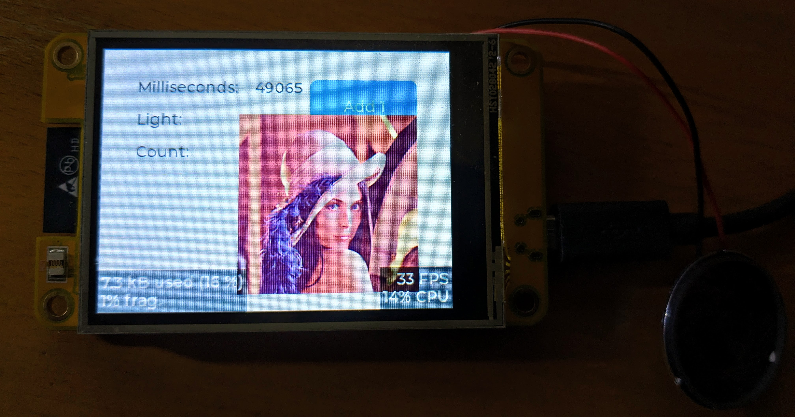
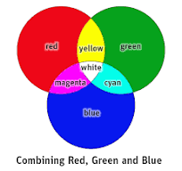

# LVGL drivers for Chinese Sunton Smart display boards, aka CYD (Cheap Yellow Display)

[](https://github.com/rzeldent/esp32-smartdisplay/actions/workflows/main.yml)
[](https://registry.platformio.org/libraries/rzeldent/esp32_smartdisplay)

## Supported boards

These Sunton boards have an LCD display and most of them have a touch interface.
More information, data sheets, ordering information etc. can be found at [Sunton Boards information](https://github.com/rzeldent/platformio-espressif32-sunton).

- N = No touch
- R = Resistive touch
- C = Capacitive touch

Currently this library supports the following boards:

- ESP32-1732S019 N/C
- ESP32-2424S012 N/C
- ESP32-2432S022 N/C
- ESP32-2432S024 R/C/N
- ESP32-2432S028 R ( 3 variants)
- ESP32-2432S032 N/R/C
- ESP32-3248S035 R/C
- ESP32-4827S043 R/C
- ESP32-4848S040C_I_Y_1/3
- ESP32-8048S050 N/C/R
- ESP32-8048S070 N/C/R

This library integrates seamlessly in [PlatformIO](https://platformio.org/) and supports these boards by providing display and touch and provides a jump start!

## Why this library

With the boards, there is a link supplied and there are a lot of examples present and this looks fine.... If you know your way around....

These examples for [LVGL](https://lvgl.io/) depend on external libraries ([TFT_eSPI](https://github.com/Bodmer/TFT_eSPI) or [LovyanGFX](https://github.com/lovyan03/LovyanGFX)) but also different touch drivers.
However, when working with these libraries, I found out that these libraries had their flaws using these boards:

- Lots of configuring to do before it all works,
- Using a third party library there is unnecessary code included (for other boards),
- No support for on the fly rotating,
- No support for touch,
- Not using code already present in the ESP firmware
- No LVGL integration
- Easy compile the same application for different boards

## Dependencies

This library depends on:

- [LVGL](https://registry.platformio.org/libraries/lvgl/lvgl), currently version 9.1.0
- [platformio-espressif32-sunton](https://github.com/rzeldent/platformio-espressif32-sunton)

> [!NOTE]
> This library uses the newly introduced esp_lcd_panel interfaces. This should provide some support in the future for updates and new boards. These drivers are provided by Espressid and have already been copied and included to this library.

## How to use

Get started by following the steps below. It is also highly recommended to look at the demo application [esp32-smartdisplay-demo](https://github.com/rzeldent/esp32-smartdisplay-demo) to quickly see the possibilities of this library.



This demo provides:

- User Interface created using the SquareLine Studio GUI generator.
- Read the CdS (light sensor)
- Control of the LEDs
- Works for all known Sunton boards (and more): see [Sunton Boards information](https://github.com/rzeldent/platformio-espressif32-sunton)
- Full source code

The next sections will guide you though the process of creating an application. However, knowledge of PlatformIO, C/C++ and LVGL is required!

If you run into problems, first try to open a discussion on the [github esp32-smartdisplay discussion board](https://github.com/rzeldent/esp32-smartdisplay/discussions).

### Step 1: Download (or open) PlatformIO

[](https://platformio.org/)

This library is made for usage in PlatformIO. If not familiar with PlatformIO please take a look at their site and micro controller boards they support. However these boards only use the Arduino platform and ESP32 boards.

Make sure you have PlatformIO installed and functional. Follow the documentation on their site:
[https://docs.platformio.org/en/latest/](https://docs.platformio.org/en/latest/)

### Step 2: Boards definitions

The board definitions required for this library are defined in the boards library [platformio-espressif32-sunton](https://github.com/rzeldent/platformio-espressif32-sunton). This library must reside in the `<project>/boards` directory so PlatformIo will automatically recognize these boards.

**It is recommended to use `git submodule` to include these board definitions automatically.**

> [!TIP]
> If you already have a project, clone it with the `git clone --recurse-submodules`. If creating a new project, use `git submodule add https://github.com/rzeldent/platformio-espressif32-sunton.git boards` to add them to your project as a submodule.

### Step 3: Create a new project

Use the standard PlatformIO create project to start a new project. When using a new PlatformIO installation these boards, defined in [platformio-espressif32-sunton](https://github.com/rzeldent/platformio-espressif32-sunton), are not present. Just use a known ESP32 board and correct this later in the platformIO file.

Optionally, you can copy the boards definition to the `<home>/.platformio\platforms\espressif32\boards` directory to have them always available but it is probably easier to create the project, add the boards as a git submodule and change the board afterwards. For each supported board there is a board definition.

### Step 4: Add this library to your project

To add this library (and its dependency on LVGL) add the following line to the `platformio.ini` file:

From the platformIO registry (version 2.0.x):

```ini
lib_deps = rzeldent/esp32_smartdisplay
```

or the Github repository:

```ini
lib_deps = https://github.com/rzeldent/esp32-smartdisplay.git
```

This will automatically download the library, the LVGL library (as a dependency) and set the defines required for the low level drivers.

### Step 5: Create a settings file for LVGL

LVGL needs a configuration file; `lv_conf.h`. This file contains information about the fonts, color depths, default background, styles, etc...
The default LVGL template can be found in the LVGL library at the location: `lvgl/lv_conf_template.h`.
This file must be copied to the include directory and renamed to `lvgl_conf.h`. Also the `#if 0` must be removed to enable the file to be included.

This file can immediately be used and is valid. Some modifications might be required fore additional features.

More information about setting up a project with LVGL can be obtained at [LVGL get-started/quick-overview](https://docs.lvgl.io/master/get-started/quick-overview.html#add-lvgl-into-your-project).
I suggest to put the `lv_conf.h` file in the include directory and set the build flags to specify the location of the file, see below.

Important settings are:

- Only the R5G6B5 format is supported on these panels.

  ```h
  /*Color depth: 1 (1 byte per pixel), 8 (RGB332), 16 (RGB565), 32 (ARGB8888)*/
  #define LV_COLOR_DEPTH 16
  ```

- For debugging, enable CPU usage, FPS (Frames per Second) and memory defragmentation

  ```h
  #define LV_USE_PERF_MONITOR 1
  #define LV_USE_MEM_MONITOR 1
  ```

For debugging it is possible to enable logging from LVGL. The library will output to the debugging output (using `lv_log_register_print_cb`).
To enable logging, set the define:

```h
/*Enable the log module*/
#define LV_USE_LOG 1
```

By default the logging is only `LV_LOG_LEVEL_WARN` but can be adjusted in the `lv_conf.h`.

To enable additional decoding options, libraries or widgets, enable them in the lv_conf.ini file by setting a LV_USE_xxxx to 1.
These are disabled by default.

```cpp
//API for LittleFs.
#define LV_USE_FS_LITTLEFS 0
//LODEPNG decoder library
#define LV_USE_LODEPNG 0
//PNG decoder(libpng) library
#define LV_USE_LIBPNG 0
//BMP decoder library
#define LV_USE_BMP 0
// JPG + split JPG decoder library.
#define LV_USE_TJPGD 0
// libjpeg-turbo decoder library.
#define LV_USE_LIBJPEG_TURBO 0
//GIF decoder library
#define LV_USE_GIF 0
//Decode bin images to RAM
#define LV_BIN_DECODER_RAM_LOAD 0
//RLE decompress library
#define LV_USE_RLE 0
//QR code library
#define LV_USE_QRCODE 0
//Barcode code library
#define LV_USE_BARCODE 0
//FreeType library
#define LV_USE_FREETYPE 0
// Built-in TTF decoder
#define LV_USE_TINY_TTF 0
//Rlottie library
#define LV_USE_RLOTTIE 0
//Enable Vector Graphic APIs
#define LV_USE_VECTOR_GRAPHIC  0
//Enable ThorVG (vector graphics library) from the src/libs folder
#define LV_USE_THORVG_INTERNAL 0
//Use lvgl built-in LZ4 lib
#define LV_USE_LZ4_INTERNAL  0
//Use external LZ4 library
#define LV_USE_LZ4_EXTERNAL  0
//FFmpeg library for image decoding and playing videos
#define LV_USE_FFMPEG 0
```

More information about the LVGL configuration can be found in the excellent [LVGL documentation](https://docs.lvgl.io).


> [!WARNING]
> After the library has been build, changes in the lv_conf.h are no longer applied because libraries are cached.
> To apply these settings, delete the `.pio` directory so the libraries will be rebuild.

### Step 6: Copy the build flags below in your project

Especially the definition of the LV_CONF_PATH is critical, this must point to an **absolute path** where the `lv_conf.h` file is located. More about this in the [section below](#more-on-lv_confh).

```ini
build_flags =
    -Ofast
    -Wall
    #-D CORE_DEBUG_LEVEL=ARDUHAL_LOG_LEVEL_VERBOSE
    #-D CORE_DEBUG_LEVEL=ARDUHAL_LOG_LEVEL_DEBUG
    #-D CORE_DEBUG_LEVEL=ARDUHAL_LOG_LEVEL_INFO
    # LVGL settings. Point to your lv_conf.h file
    -D LV_CONF_PATH="${PROJECT_DIR}/example/lv_conf.h"
```

The line in the settings logs to the serial console but can be omitted for production builds:

```ini
-D CORE_DEBUG_LEVEL=ARDUHAL_LOG_LEVEL_NONE
```

The -Wall flag can also be removed but outputs all the warnings.

### Step 7: Initialize the display (and touch) in your project

To enable to display in your project call the void `smartdisplay_init()` function at startup and optionally set the orientation:

```cpp
void setup()
{
  smartdisplay_init();

  auto display = lv_display_get_default();
  // lv_display_set_rotation(display, LV_DISPLAY_ROTATION_90);
  // lv_display_set_rotation(display, LV_DISPLAY_ROTATION_180);
  // lv_display_set_rotation(display, LV_DISPLAY_ROTATION_270);
}
```

and update tick update and drawing in the loop:

```cpp
auto lv_last_tick = millis();

void loop()
{
    // Update the ticker
    lv_tick_inc(now - lv_last_tick);
    lv_last_tick = now;
    // Update the UI
    lv_timer_handler();
}
```

## Step 8 (Optional): Create your LVGL file or use SquareLine Studio to make a design

There is a good UI designer available for LVGL and free (but some limitations) for personal use: [SquareLine Studio](https://squareline.io/):

[](https://squareline.io/)

This tool makes it easy to create transitions, insert images, attach events, work with round screens etc.. A big advantage is that the UI C-code is generated!
SquareLine als provides drivers but only export the ui files!

In the project settings change the include `lvgl/lvgl.h` to `lvgl.h`.

## Step 9: Compile, upload and enjoy

These steps should make it possible to run your application on the display!

If there are problems:

- Read this manual again to see if all the steps were followed,
- Check if you installed the board definition(s) correctly, [see](#step-2-boards-definitions),
- Check if the [demo application works](https://github.com/rzeldent/esp32-smartdisplay-demo/tree/feature/esp32s3) and look for differences,
- Check if it is a known or previously resolved issue in the [issues](https://github.com/rzeldent/esp32-smartdisplay/issues),
- Refer to the [discussions](https://github.com/rzeldent/esp32-smartdisplay/discussions),
- If all fails, submit an [issue](https://github.com/rzeldent/esp32-smartdisplay/issues), no SLA as this is done in my spare time.

## Porting from LVGL 8.3.9

There are breaking changes in LVGL. Please refer to the documentation and forums provided by LVGL to port your application.

### lv_conf.h

The lv_conf.h template has been changed quite extensively.
The best way to start is to do a fresh start using the template from ```lvgl\lv_conf_template.h```.
Copy this to your include directory and and rename this to ```lv_conf.h```.
Next, update the ```#if 0``` on top to ```#if 1``` so the wil will be included:

```c++
/* clang-format off */
#if 1 /*Set it to "1" to enable content*/
```

### Ticker

The ticker needs to be updated to keep track of time. In LVGL 8.3.8 this was done by setting: ```#define LV_TICK_CUSTOM 1```.
Now it has to be updated by your application. A solution is to put this in the loop() and combine this with the ```lv_timer_handler()```

```c++
    // Update the ticker
    static auto lv_last_tick = millis();

    auto const now = millis();
    lv_tick_inc(now - lv_last_tick);
    lv_last_tick = now;
    // Update the UI
    lv_timer_handler();
```

## More on lv_conf.h

To use the LVGL library, a `lv_conf.h` file is required to define the settings for LVGL.
As this file is referenced from the build of LVGL, the **absolute path** must be known.
Normally this file is included in the include directory of your project but also used by the LVGL in the library.

To include it globally, the define must be (for the include directory):

```ini
  -D LV_CONF_PATH=${PROJECT_INCLUDE_DIR}/lv_conf.h
```

> [!TIP]
> The template for the `lv_conf.h` file can be found in the LVGL library at `.pio/libdeps/<board>/lvgl/lv_conf_template.h`.

## LVGL initialization Functions

The library exposes the following functions.

### void smartdisplay_init()

This is the first function that needs to be called.
It initializes the display controller and touch controller and will turn on the display at 50% brightness.

### void smartdisplay_lcd_set_backlight(float duty)

Set the brightness of the backlight display. The timer used has 13 bits (0 - 8191) but this is converted into a float so the value can be set in percent..
The range is from [0, 1] so 0 is off, 0.5 is half and 1 is full brightness.

### void smartdisplay_lcd_set_brightness_cb(smartdisplay_lcd_adaptive_brightness_cb_t cb, uint interval)

This function can be called to periodically call a user defined function to set the brightness of the display. If a NULL value is passed for the parameter `cb` the functionality is disabled and the display is set to 50% brightness.

The callback function must have the following format:

```cpp
float smartdisplay_lcd_adaptive_brightness_function)()
{
  ...
  return <float[0,1]>
}
```

If the board has a CdS sensor, a callback is automatically provided. The callback can be set to the internal function `smartdisplay_lcd_set_brightness_cb`.
This function will adjust the brightness to the value read from the CdS sensor on the front of the display.

So, to enable adaptive brightness using the CdS sensor, call

```c++
smartdisplay_lcd_set_brightness_cb(smartdisplay_lcd_adaptive_brightness_cds, 100);
```

If no CdS sensor is present, for example, the time of day can be used or sunrise/set.

### void smartdisplay_led_set_rgb(bool r, bool g, bool b)

If the board has a RGB led, this function controls the on/off state of the RGB leds.
A true value means: ON (LED is lit), false turns off the led.

This function allows only 8 LED colors:

| R   | G   | B   | Color   |
| --- | --- | --- | ------- |
| 0   | 0   | 0   | Black   |
| 1   | 0   | 0   | Red     |
| 0   | 1   | 0   | Green   |
| 0   | 0   | 1   | Blue    |
| 1   | 1   | 0   | Yellow  |
| 1   | 0   | 1   | Magenta |
| 0   | 1   | 1   | Cyan    |
| 1   | 1   | 1   | White   |



### touch_calibration_data_t touch_calibration_data

This data structure holds the calibration data for the touch display. If the valid member is true, adjustments will be applied.

### touch_calibration_data_t smartdisplay_compute_touch_calibration(const lv_point_t screen[3], const lv_point_t touch[3])

This function returns the calibration data based on 3 points. The screen array contains the (selected) calibration points on the screen and the touch array the actual measured position.
The data returned can set in to the `touch_calibration_data`

## Rotation of the display and touch

The library supports rotating for most of the controllers using hardware. Support for the direct 16bits parallel connection is done using software emulation (in LVGL). Rotating the touch is done by LVGL when rotating.

From the LVGL documentation:
_The rotation values are relative to how you would rotate the physical display in the clockwise direction.
Thus, LV_DISP_ROT_90 means you rotate the hardware 90 degrees clockwise, and the display rotates 90 degrees counterclockwise to compensate._

Rotating is done calling the `lv_display_set_rotation` function in the LVGL library with the rotation:

```c++
  auto display = lv_display_get_default();
  lv_display_set_rotation(display, LV_DISPLAY_ROTATION_90);
```

Some boards are around that have flipped screens, this is probably due to differences during tha manufacturing or using different TFTs. It is possible to correct these boards overriding the default defines.

To adjust the display and touch to the default (LV_DISP_ROT_NONE) there are 6 defines in the boards definition:

| Name             | Description                                   |
| ---------------- | --------------------------------------------- |
| DISPLAY_SWAP_XY  | Swaps the X and Y coordinates for the display |
| DISPLAY_MIRROR_X | Mirrors the X coordinate for the display      |
| DISPLAY_MIRROR_Y | Mirrors the Y coordinate for the display      |
| TOUCH_SWAP_XY    | Swaps the X and Y coordinates for the touch   |
| TOUCH_MIRROR_X   | Mirrors the X coordinate for the touch        |
| TOUCH_MIRROR_Y   | Mirrors the Y coordinate for the touch        |

## Appendix: Template to support ALL the boards

The platformio.ini file below supports all the boards. This is useful when running your application on multiple boards. If using one board only, uncomment the `default_envs` for that board in the `[platformio]` section.

> [!TIP]
> When building using a pipeline (github action), the ini below, with all the boards, can be used automatically create builds for all the boards.

```ini
[platformio]
#default_envs = esp32-1732S019C
#default_envs = esp32-1732S019N
#default_envs = esp32-2424S012C
#default_envs = esp32-2424S012N
#default_envs = esp32-2432S022N
#default_envs = esp32-2432S022C
#default_envs = esp32-2432S024C
#default_envs = esp32-2432S024N
#default_envs = esp32-2432S024R
#default_envs = esp32-2432S028R
#default_envs = esp32-2432S028Rv2
#default_envs = esp32-2432S028Rv3
#default_envs = esp32-2432S032C
#default_envs = esp32-2432S032N
#default_envs = esp32-2432S032R
#default_envs = esp32-3248S035C
#default_envs = esp32-3248S035R
#default_envs = esp32-4827S043C
#default_envs = esp32-4827S043N
#default_envs = esp32-4827S043R
#default_envs = esp32-4848S040CIY1
#default_envs = esp32-4848S040CIY3
#default_envs = esp32-8048S043C
#default_envs = esp32-8048S043N
#default_envs = esp32-8048S043R
#default_envs = esp32-8048S050C
#default_envs = esp32-8048S050N
#default_envs = esp32-8048S050R
#default_envs = esp32-8048S070C
#default_envs = esp32-8048S070N
#default_envs = esp32-8048S070R
#default_envs = esp32-s3touchlcd7

[env]
platform = espressif32
framework = arduino

monitor_speed = 115200
monitor_rts = 0
monitor_dtr = 0
monitor_filters = esp32_exception_decoder

# Partition scheme for OTA
board_build.partitions = min_spiffs.csv

build_flags =
    -Ofast
    #-Wall
    -D CORE_DEBUG_LEVEL=ARDUHAL_LOG_LEVEL_VERBOSE
    # LVGL settings
    #-DLV_CONF_PATH=${PROJECT_INCLUDE_DIR}/lv_conf.h

lib_deps =
    https://github.com/rzeldent/esp32-smartdisplay.git

[env:esp32-1732S019C]
board = esp32-1732S019C

[env:esp32-1732S019N]
board = esp32-1732S019N

[env:esp32-2424S012C]
board = esp32-2424S012C

[env:esp32-2424S012N]
board = esp32-2424S012N

[env:esp32-2432S022N]
board = esp32-2432S022N

[env:esp32-2432S022C]
board = esp32-2432S022C

[env:esp32-2432S024C]
board = esp32-2432S024C

[env:esp32-2432S024N]
board = esp32-2432S024N

[env:esp32-2432S024R]
board = esp32-2432S024R

[env:esp32-2432S028R]
board = esp32-2432S028R

[env:esp32-2432S028Rv2]
board = esp32-2432S028Rv2

[env:esp32-2432S028Rv3]
board = esp32-2432S028Rv3

[env:esp32-2432S032C]
board = esp32-2432S032C

[env:esp32-2432S032N]
board = esp32-2432S032N

[env:esp32-2432S032R]
board = esp32-2432S032R

[env:esp32-3248S035C]
board = esp32-3248S035C

[env:esp32-3248S035R]
board = esp32-3248S035R

[env:esp32-4827S043C]
board = esp32-4827S043C

[env:esp32-4827S043R]
board = esp32-4827S043R

[env:esp32-4827S043N]
board = esp32-4827S043N

[env:esp32-4848S040CIY1]
board = esp32-4848S040CIY1

[env:esp32-4848S040CIY3]
board = esp32-4848S040CIY3

[env:esp32-8048S043C]
board = esp32-8048S043C

[env:esp32-8048S043N]
board = esp32-8048S043N

[env:esp32-8048S043R]
board = esp32-8048S043R

[env:esp32-8048S050C]
board = esp32-8048S050C

[env:esp32-8048S050N]
board = esp32-8048S050N

[env:esp32-8048S050R]
board = esp32-8048S050R

[env:esp32-8048S070C]
board = esp32-8048S070C

[env:esp32-8048S070N]
board = esp32-8048S070N

[env:esp32-8048S070R]
board = esp32-8048S070R

[env:esp32-s3touchlcd7]
board = esp32-s3touchlcd7
```

## Appendix: External dependencies

The following libraries are used from the [Espressif component registry](https://components.espressif.com/):

| Name                                                                                                                                              | Version |
| ------------------------------------------------------------------------------------------------------------------------------------------------- | ------- |
| [ESP_LCD_PANEL_IO_ADDITIONS](https://components.espressif.com/api/download/?object_type=component&object_id=fc4eba6f-2091-4b28-8703-df58c6c975c7) | v1.0.0  |
| [ESP IO Expander Component](https://components.espressif.com/api/download/?object_type=component&object_id=44022a0f-c4b2-40c0-b2a2-40d7b648cb52)  | v1.0.0  |
| [ESP LCD Touch](https://components.espressif.com/api/download/?object_type=component&object_id=bb4a4d94-2827-4695-84d1-1b53383b8001)              | v1.1.1  |

## Version history

- August 2024
  - LVGL 9.2
  - New boards
- July 2024
  - LVGL 9.1
  - Update to LVGL 8.4.0
  - Version 2.0.10
- March 2024
  - Rewrote drivers for devices and made them cleaner
  - More parametrization
  - Fix for more than one point received from GT911
  - Added esp32-2432S022C
  - Rotation issues fixes
- January 2024
  - Fixed esp32-8048S070C
  - Added esp32-4848S040C_I_Y_1/3
  - Added automatic brightness functionality (and CdS sensor callback)
  - Use of Sunton boards defines
  - Possibility to add calibration parameters
- December 2023
  - 2.0.2 release
  - Updated documentation
  - Added rotation
  - Added esp32-1732S019N/C
- November 2023
  - Major version update: 2.0.0
  - Rewrite of the library to support the new ESP32-C3 and ESP32-S3 panels
  - Use the new Espressif esp_lcd interface
  - Use C instead of cpp
- October 2023
  - Added support for esp32-8048S034N/C
  - Added option for flipped/mirrored TFT's
  - Changed default RGB order to BGR
  - Version 1.0.8 and 1.0.9
- September 2023
  - Added support for esp32-2432S024N/R/S
  - Version 1.0.7
- August 2023
  - Added support for esp32-8048S070N/C
  - Display buffer size configurable
- February 2023
  - Version 1.0.3
  - Added variable for the LCD panel RGB/BGR order
- February 2023
  - Version 1.0.3
  - Added mutex for access to lvgl, required for multithreading
  - Changed RGB led input to lv_color32_t
- December 2022
  - Initial version 1.0.2.
  - Drivers for ESP32-2432S028R, ESP32-3248S035R and ESP32-3248S035C displays working.
  - Sound output
  - RGB Led output
  - CDS light sensor input
- July 2022
  - Initial work started
