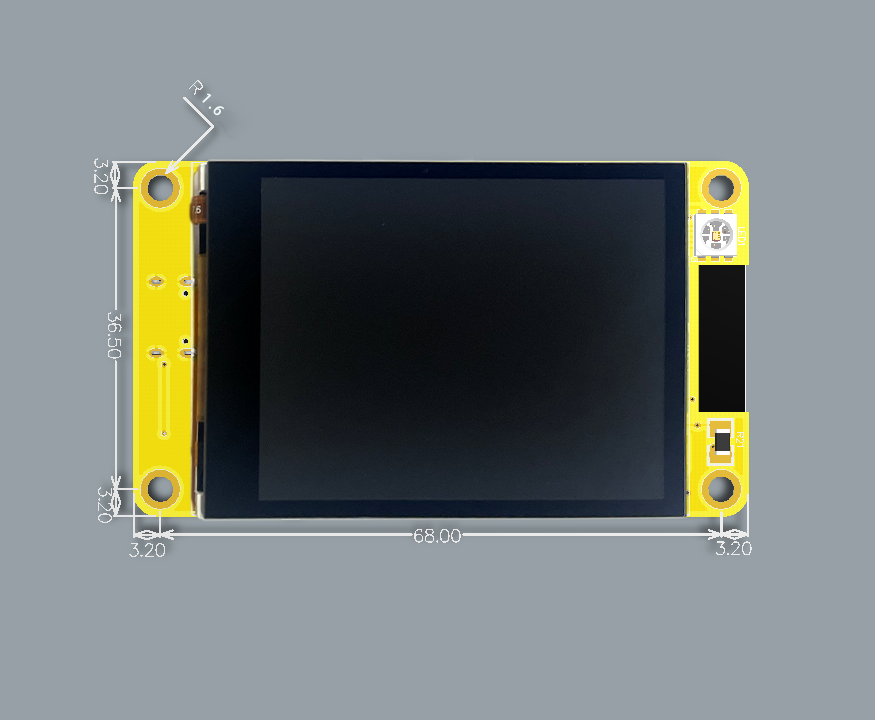

# LVGL drivers for Chinese Sunton Smart display boards, aka CYD (Cheap Yellow Display)

[](https://github.com/rzeldent/esp32-smartdisplay/actions/workflows/main.yml)

These boards have an LCD display and most of them have a touch interface.

- N = No touch
- R = Resistive touch
- C = Capacitive touch

Currently this library supports:

- ESP32_1732S019N/C
- ESP32_2424S012N/C
- ESP32_2432S024R/C/N
- ESP32_2432S028R
- ESP32_2432S032N/R/C
- ESP32_3248S035R/C
- ESP32_4827S043R/C
- ESP32_8048S050N/C
- ESP32_8048S070N/C

This library integrates seamlessly in [PlatformIO](https://platformio.org/) and supports these boards with litte effort and provides a jump start!

## Why this library

With the boards, there is a link supplied and there are a lot of examples present and this looks fine.... If you know your way around....
These examples for [LVGL](https://lvgl.io/) depend on external libraries ([LCD_eSPI](https://github.com/Bodmer/LCD_eSPI) or [LovyanGFX](https://github.com/lovyan03/LovyanGFX)).
However, when working with these libraries, I found out that these libraries had their flaws using these boards:

- Lots of configuring to do before it all works,
- Using a third party library there is unnecessary code included (for other boards),
- No support for on the fly rotating,
- No support for touch,
- Not using code already present in the ESP firmware
- No LVGL integration,
- Not adapted for use in PlatformIO

## How to obtain these boards

These boards are available on AliExpress for decent prices and offer a lot.
They can be bought in the [Sunton Store](https://www.aliexpress.com/store/1100192306) on AliExpress but are also available from other sellers. In general these boards are well packed, swiftly shipped and... really worth their money!

## Supported boards

| Type            | CPU                       | Flash | PSRAM | Cores/Speed | Display | Size  | Controller                                | Touch                                     | Audio  | Flash                                          | RGB LED  | Light sensor | Link                                                                  |
|---              |---                        |---    |---    |--           |---      |--     |---                                        |---                                        |---     |---                                             |---       |---           |---                                                                    |
| ESP32_1732S019N | ESP32-S3-WROOM-1-MCN16R8  | 16Mb  | 8Mb   | 2 x 240Mhz  | 170x320 | 1.9"  | [ST7796](assets/datasheets/ST7796.pdf)    | n/a                                       | no     | no                                             | no       | no           | [Ali Express](https://www.aliexpress.com/item/1005005059421229.html)  |
| ESP32_1732S019C | ESP32-S3-WROOM-1-MCN16R8  | 16Mb  | 8Mb   | 2 x 240Mhz  | 170x320 | 1.9"  | [ST7796](assets/datasheets/ST7796.pdf)    | [GT911](assets/datasheets//GT911.pdf)     | no     | no                                             | no       | no           | [Ali Express](https://www.aliexpress.com/item/1005005059421229.html)  |
| ESP32-2424S012N | ESP32-C3-MINI-1U-XXN4     | 4Mb   | n/a   | 1 x 160Mhz  | 240x240 | 1.2"  | [GC9A01A](assets/datasheets/GC9A01A.pdf)  | n/a                                       | no     | no                                             | no       | no           | [Ali Express](https://www.aliexpress.com/item/1005005453515690.html)  |
| ESP32-2424S012C | ESP32-C3-MINI-1U-XXN4     | 4Mb   | n/a   | 1 x 160Mhz  | 240x240 | 1.2"  | [GC9A01A](assets/datasheets/GC9A01A.pdf)  | [CST816S](assets/datasheets/CST816S.pdf)  | no     | no                                             | no       | no           | [Ali Express](https://www.aliexpress.com/item/1005005453515690.html)  |
| ESP32-2432S024N | ESP32-WROOM-32            | 4Mb   | n/a   | 2 x 240Mhz  | 240x320 | 2.4"  | [ILI9341](assets/datasheets/ILI9341.pdf)  | n/a                                       | yes    | [W25Q32JV](assets/datasheets/25Q32JVSSIQ.pdf)  | yes      | yes          | [Ali Express](https://www.aliexpress.com/item/1005005865107357.html)  |
| ESP32-2432S024R | ESP32-WROOM-32            | 4Mb   | n/a   | 2 x 240Mhz  | 240x320 | 2.4"  | [ILI9341](assets/datasheets/ILI9341.pdf)  | [XPT2046](assets/datasheets/XPT2046.pdf)  | yes    | [W25Q32JV](assets/datasheets/25Q32JVSSIQ.pdf)  | yes      | yes          | [Ali Express](https://www.aliexpress.com/item/1005005865107357.html)  |
| ESP32-2432S024C | ESP32-WROOM-32            | 4Mb   | n/a   | 2 x 240Mhz  | 240x320 | 2.4"  | [ILI9341](assets/datasheets/ILI9341.pdf)  | [CST816S](assets/datasheets/CST816S.pdf)  | yes    | [W25Q32JV](assets/datasheets/25Q32JVSSIQ.pdf)  | yes      | yes          | [Ali Express](https://www.aliexpress.com/item/1005005865107357.html)  |
| ESP32-2432S028R | ESP32-WROOM-32            | 4Mb   | n/a   | 2 x 240Mhz  | 240x320 | 2.8"  | [ILI9341](assets/datasheets/ILI9341.pdf)  | [XPT2046](assets/datasheets/XPT2046.pdf)  | yes    | [W25Q32JV](assets/datasheets/25Q32JVSSIQ.pdf)  | yes      | yes          | [Ali Express](https://www.aliexpress.com/item/1005004502250619.html)  |
| ESP32-2432S032N | ESP32-WROOM-32            | 4Mb   | n/a   | 2 x 240Mhz  | 240x320 | 3.2"  | [ST7796](assets/datasheets/ST7796.pdf)    | n/a                                       | yes    | [W25Q32JV](assets/datasheets/25Q32JVSSIQ.pdf)  | yes      | yes          | [Ali Express](https://www.aliexpress.com/item/1005006224494145.html)  |
| ESP32-2432S032R | ESP32-WROOM-32            | 4Mb   | n/a   | 2 x 240Mhz  | 240x320 | 3.2"  | [ST7796](assets/datasheets/ST7796.pdf)    | [XPT2046](assets/datasheets/XPT2046.pdf)  | yes    | [W25Q32JV](assets/datasheets/25Q32JVSSIQ.pdf)  | yes      | yes          | [Ali Express](https://www.aliexpress.com/item/1005006224494145.html)  |
| ESP32-2432S032C | ESP32-WROOM-32            | 4Mb   | n/a   | 2 x 240Mhz  | 240x320 | 3.2"  | [ST7796](assets/datasheets/ST7796.pdf)    | [GT911](assets/datasheets//GT911.pdf)     | yes    | [W25Q32JV](assets/datasheets/25Q32JVSSIQ.pdf)  | yes      | yes          | [Ali Express](https://www.aliexpress.com/item/1005006224494145.html)  |
| ESP32-3248S035R | ESP32-WROOM-32            | 4Mb   | n/a   | 2 x 240Mhz  | 320x480 | 3.5"  | [ST7796](assets/datasheets/ST7796.pdf)    | [XPT2046](assets/datasheets/XPT2046.pdf)  | yes    | [W25Q32JV](assets/datasheets/25Q32JVSSIQ.pdf)  | yes      | yes          | [Ali Express](https://www.aliexpress.com/item/1005004632953455.html)  |
| ESP32-3248S035C | ESP32-WROOM-32            | 4Mb   | n/a   | 2 x 240Mhz  | 320x480 | 3.5"  | [ST7796](assets/datasheets/ST7796.pdf)    | [GT911](assets/datasheets//GT911.pdf)     | yes    | [W25Q32JV](assets/datasheets/25Q32JVSSIQ.pdf)  | yes      | yes          | [Ali Express](https://www.aliexpress.com/item/1005004632953455.html)  |
| ESP32-4827S043R | ESP32-S3-WROOM-1-MCN16R8  | 16Mb  | 8Mb   | 2 x 240Mhz  | 480x272 | 4.3"  | Direct 16 bits parallel GPIO              | [XPT2046](assets/datasheets/XPT2046.pdf)  | no     | no                                             | no       | no           | [Ali Express](https://www.aliexpress.com/item/1005004788147691.html)  |
| ESP32-4827S043C | ESP32-S3-WROOM-1-MCN16R8  | 16Mb  | 8Mb   | 2 x 240Mhz  | 480x272 | 4.3"  | Direct 16 bits parallel GPIO              | [GT911](assets/datasheets//GT911.pdf)     | no     | no                                             | no       | no           | [Ali Express](https://www.aliexpress.com/item/1005004788147691.html)  |
| ESP32-8048S043N | ESP32-S3-WROOM-1-MCN16R8  | 16Mb  | 8Mb   | 2 x 240Mhz  | 800x480 | 4.3"  | Direct 16 bits parallel GPIO              | n/a                                       | no     | no                                             | no       | no           | [Ali Express](https://www.aliexpress.com/item/1005006110360174.html)  |
| ESP32-8048S043R | ESP32-S3-WROOM-1-MCN16R8  | 16Mb  | 8Mb   | 2 x 240Mhz  | 800x480 | 4.3"  | Direct 16 bits parallel GPIO              | [XPT2046](assets/datasheets/XPT2046.pdf)  | no     | no                                             | no       | no           | [Ali Express](https://www.aliexpress.com/item/1005006110360174.html)  |
| ESP32-8048S043C | ESP32-S3-WROOM-1-MCN16R8  | 16Mb  | 8Mb   | 2 x 240Mhz  | 800x480 | 4.3"  | Direct 16 bits parallel GPIO              | [GT911](assets/datasheets//GT911.pdf)     | no     | no                                             | no       | no           | [Ali Express](https://www.aliexpress.com/item/1005006110360174.html)  |
| ESP32-8048S050N | ESP32-S3-WROOM-1-MCN16R8  | 16Mb  | 8Mb   | 2 x 240Mhz  | 800x480 | 5.0"  | Direct 16 bits parallel GPIO              | n/a                                       | no     | no                                             | no       | no           | [Ali Express](https://www.aliexpress.com/item/1005005938915207.html)  |
| ESP32-8048S050C | ESP32-S3-WROOM-1-MCN16R8  | 16Mb  | 8Mb   | 2 x 240Mhz  | 800x480 | 5.0"  | Direct 16 bits parallel GPIO              | [GT911](assets/datasheets//GT911.pdf)     | no     | no                                             | no       | no           | [Ali Express](https://www.aliexpress.com/item/1005005938915207.html)  |
| ESP32-8048S050R | ESP32-S3-WROOM-1-MCN16R8  | 16Mb  | 8Mb   | 2 x 240Mhz  | 800x480 | 5.0"  | Direct 16 bits parallel GPIO              | [XPT2046](assets/datasheets/XPT2046.pdf)  | no     | no                                             | no       | no           | [Ali Express](https://www.aliexpress.com/item/1005005938915207.html)  |
| ESP32-8048S070N | ESP32-S3-WROOM-1-MCN16R8  | 16Mb  | 8Mb   | 2 x 240Mhz  | 800x480 | 7.0"  | Direct 16 bits parallel GPIO              | n/a                                       | no     | no                                             | no       | no           | [Ali Express](https://www.aliexpress.com/item/1005005928865239.htmlhttps://www.aliexpress.com/item/1005005928865239.html)  |
| ESP32-8048S070C | ESP32-S3-WROOM-1-MCN16R8  | 16Mb  | 8Mb   | 2 x 240Mhz  | 800x480 | 7.0"  | Direct 16 bits parallel GPIO              | [GT911](assets/datasheets//GT911.pdf)     | no     | no                                             | no       | no           | [Ali Express](https://www.aliexpress.com/item/1005005928865239.html)  |

>[!IMPORTANT]
>The additional flash chip (W25Q32JV) is not always mounted on the board.

## Dependencies

This library depends on:

- [LVGL](https://registry.platformio.org/libraries/lvgl/lvgl), currently version 8.3.9

>[!NOTE]
>This library uses the "official" drivers from Espressif's component service. These drivers use  the newly introduced esp_lcd_panel interfaces. This should provide some support in the future for updates and new boards. These drivers have been copied and included to this library.

## How to use

Get started by following te steps below. It is also highly recommended to look at the demo application [esp32-smartdisplay-demo](https://github.com/rzeldent/esp32-smartdisplay-demo/tree/feature/esp32s3) to quickly see the possibilities of this library.


Additionally this demo provides:

- UI created using the SquareLine Studio GUI generator.
- Sound over I2S and internal DAC
- Read the CDR (light sensor)
- Control of the LEDs
- PlatformIO definitions for all the known boards
- Full source code

The next sections will guide you though the process of creating an application. However, knowledge of PlatformIO, C/C++ and LVGL is required!

If you run into problems, first try to open a discussion on the [github esp32-smartdisplay discussion board](https://github.com/rzeldent/esp32-smartdisplay/discussions)

### Step 1: Download (or open) PlatformIO

[](https://platformio.org/)
This library is made for usage in PlatformIO. If not familiar with PlatformIO please take a look at their site and micro controller boards they support. However these boards only use the Arduino platform and ESP32 boards.

Make sure you have PlatformIO installed and functional. Follow the documentation on their site:
[https://docs.platformio.org/en/latest/](https://docs.platformio.org/en/latest/)

The definitions required for this library are defined in the boards. This is done because some boards use an ESP32-S3 with **16Mb flash and 8Mb PSRAM**. There is no definition for this board in the standard PlatformIO boards selection. These boards definitions contain more information than just the CPU, FLASH/PSRAM sizes etc but also information about the hardware present on the boards. See [more on board defines](#more-on-board-defines) for the details.

These boards are defined in the repository [platformio-espressif32-sunton](https://github.com/rzeldent/platformio-espressif32-sunton) so they can also be used in other projects. It is recommended to use the git submodule to include these board definitions automatically.

>[!TIP]
>If you already have a project, clone it with the ```git clone --recurse-submodules```. If creating a new project, use ```git submodule add https://github.com/rzeldent/platformio-espressif32-sunton.git boards``` to add them to your project.

### Step 2: Create a new project

Use the standard PlatformIO create project to start a new project. When using a new PlatformIO installation these boards, defined in [platformio-espressif32-sunton](https://github.com/rzeldent/platformio-espressif32-sunton), are not present.
You can copy the boards definition to the ```<home>/.platformio\platforms\espressif32\boards``` directory to have them always available but it is probably easier to create the project, add the baords as a git submodule and change the board afterwards. For each supported board there is a board definition.

### Step 3: Add this library to your project

To add this library (and its dependency on LVGL) add the following line to the ```platformio.ini``` file:

```i
lib_deps = https://github.com/rzeldent/esp32-smartdisplay.git
```

This will automatically download the library and also the LVGL library (as a dependency).

### Step 4: Create a settings file for LVGL

LVGL needs a configuration file. This file contains information about the fonts, color depths, default background, styles, etc...
The default LVGL template can be found in the LVGL library at the location: ```lvgl/lv_conf_template.h```.
This file must be copied to the include directory and renamed to ```lvgl_conf.h```. Also the ``#if 0`` must be removed to enable the file to be included.
More information about setting up a project with LVGL can be obtained at [LVGL get-started/quick-overview](https://docs.lvgl.io/master/get-started/quick-overview.html#add-lvgl-into-your-project).

>[!TIP]
>LVGL can also be downloaded manually from: [https://github.com/lvgl/lvgl/archive/master.zip](https://github.com/lvgl/lvgl/archive/master.zip) to extract the template.

Important settings are:

- Only the R5G6B5 format is supported on these panels.

  ```h
  /*Color depth: 1 (1 byte per pixel), 8 (RGB332), 16 (RGB565), 32 (ARGB8888)*/
  #define LV_COLOR_DEPTH 16
  ```

- Because of the SPI interface, the bytes are sent in big endian format so this must be corrected.
  The RGB panel interface takes care of this by swapping the GPIO lines but for the SPI controllers this is not optimal. More information about this [below](#more-on-lv_color_16_swap).

  ```h
  /*Swap the 2 bytes of RGB565 color. Useful if the display has an 8-bit interface (e.g. SPI)*/
  #define LV_COLOR_16_SWAP 1
  ```

- To have a time reference use the milliseconds reference for the Arduino

  ```h
  /*Use a custom tick source that tells the elapsed time in milliseconds and enables this code.*/
  /*It removes the need to manually update the tick with `lv_tick_inc()`)*/
  #define LV_TICK_CUSTOM 1
  ```

- For debugging, enable CPU usage, FPS (Frames per Second) and memory defragmentation

  ```h
  #define LV_USE_PERF_MONITOR 1
  #define LV_USE_MEM_MONITOR 1
  ```

- (Optionally) Include additional fonts.

  ```h
  ...
  #define LV_FONT_MONTSERRAT_22 1
  ...
  ```

- Optionally, only enable widgets that are used to save on code

  ```h
  #define LV_USE_ARC        1
  #define LV_USE_BAR        1
  #define LV_USE_BTN        1
  #define LV_USE_BTNMATRIX  1
  ...
  ```

For debugging it is possible to enable logging from LVGL. The library will output to the debugging output (using ```lv_log_register_print_cb```).
To enable logging, set the define:

```h
/*Enable the log module*/
#define LV_USE_LOG 1
```

By default the logging is only ```LV_LOG_LEVEL_WARN``` but can be ajusted in the ```lv_conf.h```.

More information about the LVGL configuration can be found in the excellent [LVGL documentation](https://docs.lvgl.io/8.3/index.html).

### Step 5: Copy the defines below in your project

Especially the definition of the LV_CONF_PATH is critical, this must point to an **absolute path** where the ```lv_conf.h``` file is located. More about this in the [section below](#more-on-lv_confh).

```ini
build_flags =
    -Ofast
    -Wall
    -D CORE_DEBUG_LEVEL=ARDUHAL_LOG_LEVEL_VERBOSE
    # LVGL settings. Point to your lv_conf.h file
    -D LV_CONF_PATH="${PROJECT_DIR}/example/lv_conf.h"
```

The line in the settings logs to the serial console but can be omitted for production builds:

```ini
-D CORE_DEBUG_LEVEL=ARDUHAL_LOG_LEVEL_VERBOSE
```

### Step 6: Initialize the display (and touch) in your project

To enable to display in your project call the initialization at startup and set the orientation:

```cpp
void setup()
{
  smartdisplay_init();

  auto disp = lv_disp_get_default();
  // lv_disp_set_rotation(disp, LV_DISP_ROT_90);
  // lv_disp_set_rotation(disp, LV_DISP_ROT_180);
  // lv_disp_set_rotation(disp, LV_DISP_ROT_270);
}
```

and update the timer (and drawing) in the loop:

```cpp
void loop()
{
  lv_timer_handler();
}
```

## Step 7: Create your LVGL file or use SquareLine Studio to make a design

There is a good UI designer available for LVGL and free (but some limitations) for personal use:
[SquareLine Studio](https://squareline.io/):

[](https://squareline.io/)

This tool makes it easy to create transitions, insert images, work with round screens etc..
A big advantage is that the UI C-code is generated!

## Step 8: Compile, upload and enjoy

These steps should make it possible to run your application on the display!

If there are problems:

- Read this manual again to see if all the steps were followed
- If using the ESP32-S3, check if you installed the board correctly
- Check if the [demo application works](https://github.com/rzeldent/esp32-smartdisplay-demo/tree/feature/esp32s3) and look for differences
- Check if it is a known or previously resolved issue in the [issues](https://github.com/rzeldent/esp32-smartdisplay/issues)
- Refer to the [discussions](https://github.com/rzeldent/esp32-smartdisplay/discussions)
- If all fails, submit an [issue](https://github.com/rzeldent/esp32-smartdisplay/issues) but there are no guarantees as this is done in my spare time.

## More on board defines

The [board definitions](https://github.com/rzeldent/platformio-espressif32-sunton) also contain information about the hardware available and how connected.
The table below provides some explanation. At the moment of writing this in still incomplete because focus has been on implementing the defines required for the display and touch.

| Define                              | Explanation                                                     |
|---                                  |---                                                              |
| ESP32_wwhhS0ddN/R/C                 | The board name, e.g. 2423S012C, see [boards](#supported-boards) |
|                                     |                                                                 |
| BOARD_HAS_PSRAM                     | The boards has PSRAM                                            |
|                                     |                                                                 |
| BUTTON_BOOT_GPIO                    | GPIO of the BOOT pushbutton                                     |
|                                     |                                                                 |
| LCD_USES_ST7789                     | LCD uses the ST7789 display driver                              |
| LCD_USES_GC9A01                     | LCD uses the GC9A01 display driver                              |
| LCD_USES_ILI9341                    | LCD uses the ILI9341 display driver                             |
| LCD_USES_DIRECT_IO                  | LCD uses direct IO with the display                             |
|                                     |                                                                 |
| LCD_WIDTH                           | The width of the LCD panel in pixels                            |
| LCD_HEIGHT                          | The height of the LCD panel in pixels                           |
| LCD_BCKL_GPIO                       | GPIO of the backlight                                           |
| LCD_SPI_HOST                        | The SPI host to use for the LCD driver                          |
| LCD_SPI_BUS_CONFIG                  | The LCD SPI BUS configuration                                   |
| LCD_IO_SPI_CONFIG                   | The LCD IO SPI configuration                                    |
| LCD_PANEL_DEV_CONFIG                | The LCD panel device configuration                              |
| LCD_RGB_PANEL_CONFIG                | The LCD panel settings for LV_COLOR_16_SWAP = 0                 |
| LCD_RGB_PANEL_CONFIG_COLOR_16_SWAP  | The LCD panel settings for LV_COLOR_16_SWAP = 1                 |
| LCD_SWAP_XY                         | Swap the X and Y axes for the panel                             |
| LCD_MIRROR_X                        | Mirror the panel horizontally                                   |
| LCD_MIRROR_Y                        | Mirror the panel vertically                                     |
| LCD_GAP_X                           | The horizontal gap in pixels before the panel                   |
| LCD_GAP_Y                           | The vertical gap in pixels before the panel                     |
|                                     |                                                                 |
| BOARD_HAS_TOUCH                     | The panel has a touch interface                                 |
| TOUCH_USES_GT911                    | Touch uses the GT911 capacitive touch controller                |
| TOUCH_USES_CST816S                  | Touch uses the CST816S capacitive touch controller              |
| TOUCH_USES_XPT2046                  | Touch uses the XPT2046 resistive  touch controller              |
|                                     |                                                                 |
| TOUCH_I2C_HOST                      | The I2C host to use for the touch controller                    |
| TOUCH_I2C_CONFIG                    | The touch I2C configuration                                     |
| TOUCH_IO_I2C_CONFIG                 | The touch IO I2C configuration                                  |
| TOUCH_DEV_CONFIG                    | The touch device configuration                                  |
| TOUCH_SWAP_X                        | Swap the touch horizontally                                     |
| TOUCH_SWAP_Y                        | Swap the touch vertically                                       |
|                                     |                                                                 |
| BOARD_HAS_TF                        | The board has a TF slot                                         |
| TF_CS_GPIO                          | GPIO of the CS of the TF slot                                   |
| TF_MOSI_GPIO                        | GPIO of the MOSI of the TF slot                                 |
| TF_SCLK_GPIO                        | GPIO of the SCLK of the TF slot                                 |
| TF_MISO_GPIO                        | GPIO of the MISO of the TF slot                                 |
|                                     |                                                                 |
| BOARD_HAS_RGB_LED                   | The board has an RGB led                                        |
| LED_R_GPIO                          | GPIO of the red LED                                             |
| LED_G_GPIO                          | GPIO of the green LED                                           |
| LED_B_GPIO                          | GPIO of the blue LED                                            |
|                                     |                                                                 |
| BOARD_HAS_CDS                       | The board has a CdS resistive light sensor                      |
| CDS_GPIO                            | Analogue GPIO input of the CdS sensor                           |
|                                     |                                                                 |
| BOARD_HAS_SPEAK_GPIO                | The board has an onboard amplifier for a speaker                |
| SPEAK_GPIO                          | GPIO of the speaker                                             |

## More on lv_conf.h

To use the LVGL library, a `lv_conf.h` file is required to define the settings for LVGL.
This file needs to be provided by the application.
As this file is referenced from the build of LVGL, the path must be known.
Normally this file is included in the include directory of **your** project and used by the LVGL library.

To include it globally, the define must be (for the include directory):

```ini
  -D LV_CONF_PATH=${PROJECT_INCLUDE_DIR}/lv_conf.h
```

>[!TIP]
>The template for the `lv_conf.h` file can be found in the LVGL library at `.pio/libdeps/<board>/lvgl/lv_conf_template.h`.

## More on PSRAM

At boot the ESP32 has approx 315Kb usable memory (from the 520Kb present).
Displays wit a controller do not have an internal frame buffer to save the state of the display.
However, if the display is using the direct 16bits parallel connection, there is no controller and the contents of the RAM is copied to the display at a fast rate.
This buffer is allocated from the memory of the ESP32.

If using the normal SRAM, this would (for the ESP32_4827S043 with a 480x270 pixels) snoop away 480x270x2 = 261120 bytes, leaving only 54140 bytes for the application. This can be done and works.
However, the other boards with a resolution of 800x480, 800x480x2 = 768000 bytes are required. This is more than the available RAM.

This is the reason for boards with a direct 16bits parallel connection 8Mb of PSRAM is added and should be used to store this buffer.

The standard definition of the ```esp32-s3-devkitc-1.json``` does not have any configuration for the increases flash size and PSRAM. That's the reason a special board definition has been created: ```esp32-s3-devkitc-1-n16-psram.json```.

## More on LV_COLOR_16_SWAP

The LVGL library has a define called **LV_COLOR_16_SWAP** in the ```lvgl_conf.h```. The value can be 1 or 0.
This variable will swap the byte order of the lv_color16_t. This is required because the SPI is by default LSB first.

Setting this variable to true is recommended for the SPI interfaces: ST7789, GC9A01A, ILI9341 and ST7796. If not, a warning will be issued but the code should work. The parallel 16 bits panels without interface are not affected by this; the GPIO pin layout will change accordingly.

This makes it easier to have only one definition for lv_conf.h and SquareLine.

>[!IMPORTANT]
>If this is not done, the code will run but swapping will be done runtime (and degrading the performance).
>So it is recommended to always set the LV_COLOR_16_SWAP to 1.

Additionally, when using the [SquareLine Studio](https://squareline.io/) for designing the user interface, the display properties (under the project settings) must match this variable.
It needs to be set both in `lv_conf.h` configuration file and the corresponding display properties (16 bit swap) in [SquareLine Studio](https://squareline.io/).


## LVGL initialization Functions

The library exposes the following functions.

### void smartdisplay_init()

This is the first function that needs to be called.
It initializes the display controller and touch controller and will turn on the display at 50% brightness.

### void smartdisplay_tft_set_backlight(float duty)

Set the brightness of the backlight display.
The range is from [0, 1] so 0 is off, 0.5 is half and 1 is full brightness.

## Rotation

The library supports rotating for most of the controllers. Support for the direct 16bits parallel connection is done using software emulation (in LVGL).

Rotating is done calling the ```lv_disp_set_rotation``` function in the LVGL library with the rotation:

```c++
  auto disp = lv_disp_get_default();
  lv_disp_set_rotation(disp, LV_DISP_ROT_90);
```

## Controlling the RGB led

>[!NOTE]
>Not all boards have a LED. Refer to the [supported boards](#supported-boards) to see if this is available.

If the board has an RGB led, the define ```BOARD_HAS_RGB_LED``` is defined.
Additionally, the following defines are present for the definition of the GPIO pins:

- LED_R_GPIO
- LED_G_GPIO
- LED_B_GPIO

Before using the RGB LEDs, the GPIOs must be defined as output

```c++
  pinmode(LED_R_GPIO, OUTPUT);
  pinmode(LED_G_GPIO, OUTPUT);
  pinmode(LED_B_GPIO, OUTPUT);
```

The LEDs are connected between the GPIO pin and the 3.3V. So the LED will light up if the GPIO is set to LOW (inverted).


For example: set the RGB led to red is done by the following code:

```c++
  digitalWrite(LED_R_GPIO, false);
  digitalWrite(LED_G_GPIO, true);
  digitalWrite(LED_B_GPIO, true);
```

To have more colors than the 8 RGB combinations, PWM can be used to mix the colors.
To do this, attach a PWM channel to each GPIO pin to modulate the intensity.

>[!WARNING]
>The number of PWM channels is limited and some channels are reserved for some functions
>e.g. channel 0 is used by the tone() function but can be used if this function is not called.

Example:
Set PWM channel 0 to 5000Hz with a resolution of 8 bits (256 levels) and attach it to the red LED.
Next, set the level to 25%. This is 192 (256 - 25%) because of the inverted output.

>[!CAUTION]
>The functions for using PWM will change in the upcoming release of the IDF and will break the usage of the PWM functions!

ESP_ARDUINO_VERSION_MAJOR < 3:

```c++
  ledcSetup(0, 5000, 8);
  ledcAttachPin(LED_R_GPIO, 0);
  ledcWrite(0, 192);
```

ESP_ARDUINO_VERSION_MAJOR >= 3

```c++
  ledcAttach(LED_R_GPIO, 0, 8);
  ledcWrite(LED_R_GPIO, 192);
```

## Reading the CDS (light sensor)

>[!NOTE]
>Not all boards have a light sensor. Refer to the [supported boards](#supported-boards) to see if this is available.

If the board has a CDS photo resistor (Cadmium Sulfide, CdS) light sensor, the define ```BOARD_HAS_CDS``` is defined.
It is attached to the analogue input of the ESP32 with two resistors between the GND and the VCC. When the CDS is covered, it's resistance is in the order of mega&Omega; but in bright light can drop to a few 100&Omega;.


To use the sensor, the define ```BOARD_HAS_CDS``` indicates the analogue port to read.

```c++
  analogSetAttenuation(ADC_0db); // 0dB(1.0x) 0~800mV
  pinMode(CDS_GPIO, INPUT);
```

Next, read the value using:

```c++
  auto value = analogReadMilliVolts(CDS_GPIO);
```

The value ranges from 75mV (not covered) to 400mV (completely covered).

## Controlling the speaker

>[!NOTE]
>Not all boards have a LED. Refer to the [supported boards](#supported-boards) to see if this is available.

An 8&Omega; speaker can be connected to the output marked SPEAK. This is a 1.25 JST connector.
Beeps can be generated by generating a PWM signal on the SPEAK_GPIO:

```c++
pinmode(SPEAK_GPIO, OUTPUT)
// Uses PWM Channel 0
tone(SPEAK_GPIO, frequency, duration);
```

To produce "real" audio connect the internal 8 bits D2A converter in the ESP32. Because the speaker is connected to GPIO26, this is the DAC2 (Left Channel).

>[!TIP]
>Make sure the I2S connection is only to the LEFT channel.

The audio is a bit distorted. [HexeguitarDIY](https://github.com/hexeguitar/ESP32_LCD_PIO) has a fix for that by changing the resistor values to prevent distortion.
[](https://www.youtube.com/watch?v=6JCLHIXXVus)

## Appendix: Board details

### ESP32_1732S019 N/C

- USB-C

### ESP32-2424S012 N/C

- USB-C
- I2C: 1 x SH1.0 4p
- Power: JST1.25 2p


### ESP32-2432S024 N/R/C

- Micro USB
- I2C: 2 x JST1.25 4p
- Power + Serial: JST1.25 4p
- Speaker: JST1.25 2p



### ESP32-2432S028 R

- Micro USB
- I2C: 2 x JST1.25 4p
- Power + Serial: JST1.25 4p
- Speaker: JST1.25 2p


### ESP32-3248S035

- Micro USB
- I2C: 2 x JST1.25 4p
- Power + Serial: JST1.25 4p
- Speaker: JST1.25 2p


### ESP32-4827S043

- USB-C
- I2C: JST1.25 4p
- Power + Serial: JST1.25 4p


### ESP32-8048S050

- USB-C
- I2C: JST1.25 4p
- Power + Serial: JST1.25 4p


### ESP32-8048S070

- USB-C
- I2C: JST1.25 4p
- Power + Serial: JST1.25 4p


## Appendix: Template to support ALL the boards

The platformio.ini file below supports all the boards. This is useful when running your application on multiple boards.

>[!TIP]
>When building using a pipeline (github action), the board can be defined and automatically create builds for all the boards.

```ini
[platformio]
#default_envs = esp32-2424S012C
#default_envs = esp32-2424S012N
#default_envs = esp32-2432S024C
#default_envs = esp32-2432S024N
#default_envs = esp32-2432S024R
#default_envs = esp32-2432S028R
#default_envs = esp32-2432S032C
#default_envs = esp32-2432S032N
#default_envs = esp32-2432S032R
#default_envs = esp32-3248S035C
#default_envs = esp32-3248S035R
#default_envs = esp32-1732S019C
#default_envs = esp32-1732S019N
#default_envs = esp32-4827S043C
#default_envs = esp32-4827S043N
#default_envs = esp32-4827S043R
#default_envs = esp32-8048S043C
#default_envs = esp32-8048S043N
#default_envs = esp32-8048S043R
#default_envs = esp32-8048S050C
#default_envs = esp32-8048S050N
#default_envs = esp32-8048S050R
#default_envs = esp32-8048S070C
#default_envs = esp32-8048S070N

[env]
platform = espressif32
framework = arduino

build_flags =
    -Ofast
    -Wall
    -D CORE_DEBUG_LEVEL=ARDUHAL_LOG_LEVEL_VERBOSE
    # LVGL settings. Point to your lv_conf.h file
    -D LV_CONF_PATH="${PROJECT_DIR}/example/lv_conf.h"

[env:esp32-2424S012C]
board = esp32-2424S012C

[env:esp32-2424S012N]
board = esp32-2424S012N

[env:esp32-2432S024C]
board = esp32-2432S024C

[env:esp32-2432S024N]
board = esp32-2432S024N

[env:esp32-2432S024R]
board = esp32-2432S024R

[env:esp32-2432S028R]
board = esp32-2432S024R

[env:esp32-2432S032C]
board = esp32-2432S032C

[env:esp32-2432S032N]
board = esp32-2432S032N

[env:esp32-2432S032R]
board = esp32-2432S032R

[env:esp32-3248S035C]
board = esp32-3248S035C

[env:esp32-3248S035R]
board = esp32-3248S035R

[env:esp32-1732S019C]
board = esp32-1732S019C

[env:esp32-1732S019N]
board = esp32-1732S019N

[env:esp32-4827S043C]
board = esp32-4827S043C

[env:esp32-4827S043N]
board = esp32-4827S043N

[env:esp32-4827S043R]
board = esp32-4827S043R

[env:esp32-8048S043C]
board = esp32-8048S043C

[env:esp32-8048S043N]
board = esp32-8048S043N

[env:esp32-8048S043R]
board = esp32-8048S043R

[env:esp32-8048S050C]
board = esp32-8048S050C

[env:esp32-8048S050N]
board = esp32-8048S050N

[env:esp32-8048S050R]
board = esp32-8048S050R

[env:esp32-8048S070C]
board = esp32-8048S070C

[env:esp32-8048S070N]
board = esp32-8048S070N
```

## Appendix: lv_conf.h example

```cpp
/**
 * @file lv_conf.h
 * Configuration file for v8.3.2
 */

/*
 * Copy this file as `lv_conf.h`
 * 1. simply next to the `lvgl` folder
 * 2. or any other places and
 *    - define `LV_CONF_INCLUDE_SIMPLE`
 *    - add the path as include path
 */

/* clang-format off */
#if 1 /*Set it to "1" to enable content*/

#ifndef LV_CONF_H
#define LV_CONF_H

#include <stdint.h>

/*====================
   COLOR SETTINGS
 *====================*/

/*Color depth: 1 (1 byte per pixel), 8 (RGB332), 16 (RGB565), 32 (ARGB8888)*/
#define LV_COLOR_DEPTH 16

/*Swap the 2 bytes of RGB565 color. Useful if the display has an 8-bit interface (e.g. SPI)*/
#define LV_COLOR_16_SWAP 1

/*Enable features to draw on transparent background.
 *It's required if opa, and transform_* style properties are used.
 *Can be also used if the UI is above another layer, e.g. an OSD menu or video player.*/
#define LV_COLOR_SCREEN_TRANSP 0

/* Adjust color mix functions rounding. GPUs might calculate color mix (blending) differently.
 * 0: round down, 64: round up from x.75, 128: round up from half, 192: round up from x.25, 254: round up */
#define LV_COLOR_MIX_ROUND_OFS 0

/*Images pixels with this color will not be drawn if they are chroma keyed)*/
#define LV_COLOR_CHROMA_KEY lv_color_hex(0x00ff00)         /*pure green*/

/*=========================
   MEMORY SETTINGS
 *=========================*/

/*1: use custom malloc/free, 0: use the built-in `lv_mem_alloc()` and `lv_mem_free()`*/
#define LV_MEM_CUSTOM 0
#if LV_MEM_CUSTOM == 0
    /*Size of the memory available for `lv_mem_alloc()` in bytes (>= 2kB)*/
    #define LV_MEM_SIZE (48U * 1024U)          /*[bytes]*/

    /*Set an address for the memory pool instead of allocating it as a normal array. Can be in external SRAM too.*/
    #define LV_MEM_ADR 0     /*0: unused*/
    /*Instead of an address give a memory allocator that will be called to get a memory pool for LVGL. E.g. my_malloc*/
    #if LV_MEM_ADR == 0
        #undef LV_MEM_POOL_INCLUDE
        #undef LV_MEM_POOL_ALLOC
    #endif

#else       /*LV_MEM_CUSTOM*/
    #define LV_MEM_CUSTOM_INCLUDE <stdlib.h>  /*Header for the dynamic memory function*/
    #define LV_MEM_CUSTOM_ALLOC   malloc
    #define LV_MEM_CUSTOM_FREE    free
    #define LV_MEM_CUSTOM_REALLOC realloc
#endif     /*LV_MEM_CUSTOM*/

/*Number of the intermediate memory buffer used during rendering and other internal processing mechanisms.
 *You will see an error log message if there wasn't enough buffers. */
#define LV_MEM_BUF_MAX_NUM 16

/*Use the standard `memcpy` and `memset` instead of LVGL's own functions. (Might or might not be faster).*/
#define LV_MEMCPY_MEMSET_STD 0

/*====================
   HAL SETTINGS
 *====================*/

/*Default display refresh period. LVG will redraw changed areas with this period time*/
#define LV_DISP_DEF_REFR_PERIOD 30      /*[ms]*/

/*Input device read period in milliseconds*/
#define LV_INDEV_DEF_READ_PERIOD 30     /*[ms]*/

/*Use a custom tick source that tells the elapsed time in milliseconds.
 *It removes the need to manually update the tick with `lv_tick_inc()`)*/
#define LV_TICK_CUSTOM 1
#if LV_TICK_CUSTOM
    #define LV_TICK_CUSTOM_INCLUDE "Arduino.h"         /*Header for the system time function*/
    #define LV_TICK_CUSTOM_SYS_TIME_EXPR (millis())    /*Expression evaluating to current system time in ms*/
#endif   /*LV_TICK_CUSTOM*/

/*Default Dot Per Inch. Used to initialize default sizes such as widgets sized, style paddings.
 *(Not so important, you can adjust it to modify default sizes and spaces)*/
#define LV_DPI_DEF 130     /*[px/inch]*/

/*=======================
 * FEATURE CONFIGURATION
 *=======================*/

/*-------------
 * Drawing
 *-----------*/

/*Enable complex draw engine.
 *Required to draw shadow, gradient, rounded corners, circles, arc, skew lines, image transformations or any masks*/
#define LV_DRAW_COMPLEX 1
#if LV_DRAW_COMPLEX != 0

    /*Allow buffering some shadow calculation.
    *LV_SHADOW_CACHE_SIZE is the max. shadow size to buffer, where shadow size is `shadow_width + radius`
    *Caching has LV_SHADOW_CACHE_SIZE^2 RAM cost*/
    #define LV_SHADOW_CACHE_SIZE 0

    /* Set number of maximally cached circle data.
    * The circumference of 1/4 circle are saved for anti-aliasing
    * radius * 4 bytes are used per circle (the most often used radiuses are saved)
    * 0: to disable caching */
    #define LV_CIRCLE_CACHE_SIZE 4
#endif /*LV_DRAW_COMPLEX*/

/**
 * "Simple layers" are used when a widget has `style_opa < 255` to buffer the widget into a layer
 * and blend it as an image with the given opacity.
 * Note that `bg_opa`, `text_opa` etc don't require buffering into layer)
 * The widget can be buffered in smaller chunks to avoid using large buffers.
 *
 * - LV_LAYER_SIMPLE_BUF_SIZE: [bytes] the optimal target buffer size. LVGL will try to allocate it
 * - LV_LAYER_SIMPLE_FALLBACK_BUF_SIZE: [bytes]  used if `LV_LAYER_SIMPLE_BUF_SIZE` couldn't be allocated.
 *
 * Both buffer sizes are in bytes.
 * "Transformed layers" (where transform_angle/zoom properties are used) use larger buffers
 * and can't be drawn in chunks. So these settings affects only widgets with opacity.
 */
#define LV_LAYER_SIMPLE_BUF_SIZE          (24 * 1024)
#define LV_LAYER_SIMPLE_FALLBACK_BUF_SIZE (3 * 1024)

/*Default image cache size. Image caching keeps the images opened.
 *If only the built-in image formats are used there is no real advantage of caching. (I.e. if no new image decoder is added)
 *With complex image decoders (e.g. PNG or JPG) caching can save the continuous open/decode of images.
 *However the opened images might consume additional RAM.
 *0: to disable caching*/
#define LV_IMG_CACHE_DEF_SIZE 0

/*Number of stops allowed per gradient. Increase this to allow more stops.
 *This adds (sizeof(lv_color_t) + 1) bytes per additional stop*/
#define LV_GRADIENT_MAX_STOPS 2

/*Default gradient buffer size.
 *When LVGL calculates the gradient "maps" it can save them into a cache to avoid calculating them again.
 *LV_GRAD_CACHE_DEF_SIZE sets the size of this cache in bytes.
 *If the cache is too small the map will be allocated only while it's required for the drawing.
 *0 mean no caching.*/
#define LV_GRAD_CACHE_DEF_SIZE 0

/*Allow dithering the gradients (to achieve visual smooth color gradients on limited color depth display)
 *LV_DITHER_GRADIENT implies allocating one or two more lines of the object's rendering surface
 *The increase in memory consumption is (32 bits * object width) plus 24 bits * object width if using error diffusion */
#define LV_DITHER_GRADIENT 0
#if LV_DITHER_GRADIENT
    /*Add support for error diffusion dithering.
     *Error diffusion dithering gets a much better visual result, but implies more CPU consumption and memory when drawing.
     *The increase in memory consumption is (24 bits * object's width)*/
    #define LV_DITHER_ERROR_DIFFUSION 0
#endif

/*Maximum buffer size to allocate for rotation.
 *Only used if software rotation is enabled in the display driver.*/
#define LV_DISP_ROT_MAX_BUF (10*1024)

/*-------------
 * GPU
 *-----------*/

/*Use Arm's 2D acceleration library Arm-2D */
#define LV_USE_GPU_ARM2D 0

/*Use STM32's DMA2D (aka Chrom Art) GPU*/
#define LV_USE_GPU_STM32_DMA2D 0
#if LV_USE_GPU_STM32_DMA2D
    /*Must be defined to include path of CMSIS header of target processor
    e.g. "stm32f769xx.h" or "stm32f429xx.h"*/
    #define LV_GPU_DMA2D_CMSIS_INCLUDE
#endif

/*Use SWM341's DMA2D GPU*/
#define LV_USE_GPU_SWM341_DMA2D 0
#if LV_USE_GPU_SWM341_DMA2D
    #define LV_GPU_SWM341_DMA2D_INCLUDE "SWM341.h"
#endif

/*Use NXP's PXP GPU iMX RTxxx platforms*/
#define LV_USE_GPU_NXP_PXP 0
#if LV_USE_GPU_NXP_PXP
    /*1: Add default bare metal and FreeRTOS interrupt handling routines for PXP (lv_gpu_nxp_pxp_osa.c)
    *   and call lv_gpu_nxp_pxp_init() automatically during lv_init(). Note that symbol SDK_OS_FREE_RTOS
    *   has to be defined in order to use FreeRTOS OSA, otherwise bare-metal implementation is selected.
    *0: lv_gpu_nxp_pxp_init() has to be called manually before lv_init()
    */
    #define LV_USE_GPU_NXP_PXP_AUTO_INIT 0
#endif

/*Use NXP's VG-Lite GPU iMX RTxxx platforms*/
#define LV_USE_GPU_NXP_VG_LITE 0

/*Use SDL renderer API*/
#define LV_USE_GPU_SDL 0
#if LV_USE_GPU_SDL
    #define LV_GPU_SDL_INCLUDE_PATH <SDL2/SDL.h>
    /*Texture cache size, 8MB by default*/
    #define LV_GPU_SDL_LRU_SIZE (1024 * 1024 * 8)
    /*Custom blend mode for mask drawing, disable if you need to link with older SDL2 lib*/
    #define LV_GPU_SDL_CUSTOM_BLEND_MODE (SDL_VERSION_ATLEAST(2, 0, 6))
#endif

/*-------------
 * Logging
 *-----------*/

/*Enable the log module*/
#define LV_USE_LOG 1
#if LV_USE_LOG

    /*How important log should be added:
    *LV_LOG_LEVEL_TRACE       A lot of logs to give detailed information
    *LV_LOG_LEVEL_INFO        Log important events
    *LV_LOG_LEVEL_WARN        Log if something unwanted happened but didn't cause a problem
    *LV_LOG_LEVEL_ERROR       Only critical issue, when the system may fail
    *LV_LOG_LEVEL_USER        Only logs added by the user
    *LV_LOG_LEVEL_NONE        Do not log anything*/
    #define LV_LOG_LEVEL LV_LOG_LEVEL_WARN

    /*1: Print the log with 'printf';
    *0: User need to register a callback with `lv_log_register_print_cb()`*/
    #define LV_LOG_PRINTF 0

    /*Enable/disable LV_LOG_TRACE in modules that produces a huge number of logs*/
    #define LV_LOG_TRACE_MEM        1
    #define LV_LOG_TRACE_TIMER      1
    #define LV_LOG_TRACE_INDEV      1
    #define LV_LOG_TRACE_DISP_REFR  1
    #define LV_LOG_TRACE_EVENT      1
    #define LV_LOG_TRACE_OBJ_CREATE 1
    #define LV_LOG_TRACE_LAYOUT     1
    #define LV_LOG_TRACE_ANIM       1

#endif  /*LV_USE_LOG*/

/*-------------
 * Asserts
 *-----------*/

/*Enable asserts if an operation is failed or an invalid data is found.
 *If LV_USE_LOG is enabled an error message will be printed on failure*/
#define LV_USE_ASSERT_NULL          1   /*Check if the parameter is NULL. (Very fast, recommended)*/
#define LV_USE_ASSERT_MALLOC        1   /*Checks is the memory is successfully allocated or no. (Very fast, recommended)*/
#define LV_USE_ASSERT_STYLE         0   /*Check if the styles are properly initialized. (Very fast, recommended)*/
#define LV_USE_ASSERT_MEM_INTEGRITY 0   /*Check the integrity of `lv_mem` after critical operations. (Slow)*/
#define LV_USE_ASSERT_OBJ           0   /*Check the object's type and existence (e.g. not deleted). (Slow)*/

/*Add a custom handler when assert happens e.g. to restart the MCU*/
#define LV_ASSERT_HANDLER_INCLUDE <stdint.h>
#define LV_ASSERT_HANDLER while(1);   /*Halt by default*/

/*-------------
 * Others
 *-----------*/

/*1: Show CPU usage and FPS count*/
#define LV_USE_PERF_MONITOR 1
#if LV_USE_PERF_MONITOR
    #define LV_USE_PERF_MONITOR_POS LV_ALIGN_BOTTOM_RIGHT
#endif

/*1: Show the used memory and the memory fragmentation
 * Requires LV_MEM_CUSTOM = 0*/
#define LV_USE_MEM_MONITOR 1
#if LV_USE_MEM_MONITOR
    #define LV_USE_MEM_MONITOR_POS LV_ALIGN_BOTTOM_LEFT
#endif

/*1: Draw random colored rectangles over the redrawn areas*/
#define LV_USE_REFR_DEBUG 0

/*Change the built in (v)snprintf functions*/
#define LV_SPRINTF_CUSTOM 0
#if LV_SPRINTF_CUSTOM
    #define LV_SPRINTF_INCLUDE <stdio.h>
    #define lv_snprintf  snprintf
    #define lv_vsnprintf vsnprintf
#else   /*LV_SPRINTF_CUSTOM*/
    #define LV_SPRINTF_USE_FLOAT 0
#endif  /*LV_SPRINTF_CUSTOM*/

#define LV_USE_USER_DATA 1

/*Garbage Collector settings
 *Used if lvgl is bound to higher level language and the memory is managed by that language*/
#define LV_ENABLE_GC 0
#if LV_ENABLE_GC != 0
    #define LV_GC_INCLUDE "gc.h"                           /*Include Garbage Collector related things*/
#endif /*LV_ENABLE_GC*/

/*=====================
 *  COMPILER SETTINGS
 *====================*/

/*For big endian systems set to 1*/
#define LV_BIG_ENDIAN_SYSTEM 0

/*Define a custom attribute to `lv_tick_inc` function*/
#define LV_ATTRIBUTE_TICK_INC

/*Define a custom attribute to `lv_timer_handler` function*/
#define LV_ATTRIBUTE_TIMER_HANDLER

/*Define a custom attribute to `lv_disp_flush_ready` function*/
#define LV_ATTRIBUTE_FLUSH_READY

/*Required alignment size for buffers*/
#define LV_ATTRIBUTE_MEM_ALIGN_SIZE 1

/*Will be added where memories needs to be aligned (with -Os data might not be aligned to boundary by default).
 * E.g. __attribute__((aligned(4)))*/
#define LV_ATTRIBUTE_MEM_ALIGN

/*Attribute to mark large constant arrays for example font's bitmaps*/
#define LV_ATTRIBUTE_LARGE_CONST

/*Compiler prefix for a big array declaration in RAM*/
#define LV_ATTRIBUTE_LARGE_RAM_ARRAY

/*Place performance critical functions into a faster memory (e.g RAM)*/
#define LV_ATTRIBUTE_FAST_MEM

/*Prefix variables that are used in GPU accelerated operations, often these need to be placed in RAM sections that are DMA accessible*/
#define LV_ATTRIBUTE_DMA

/*Export integer constant to binding. This macro is used with constants in the form of LV_<CONST>that
 *should also appear on LVGL binding API such as Micropython.*/
#define LV_EXPORT_CONST_INT(int_value) struct _silence_gcc_warning /*The default value just prevents GCC warning*/

/*Extend the default -32k..32k coordinate range to -4M..4M by using int32_t for coordinates instead of int16_t*/
#define LV_USE_LARGE_COORD 0

/*==================
 *   FONT USAGE
 *===================*/

/*Montserrat fonts with ASCII range and some symbols using bpp = 4
 *https://fonts.google.com/specimen/Montserrat*/
#define LV_FONT_MONTSERRAT_8  0
#define LV_FONT_MONTSERRAT_10 0
#define LV_FONT_MONTSERRAT_12 0
#define LV_FONT_MONTSERRAT_14 1
#define LV_FONT_MONTSERRAT_16 0
#define LV_FONT_MONTSERRAT_18 0
#define LV_FONT_MONTSERRAT_20 0
#define LV_FONT_MONTSERRAT_22 1
#define LV_FONT_MONTSERRAT_24 0
#define LV_FONT_MONTSERRAT_26 0
#define LV_FONT_MONTSERRAT_28 0
#define LV_FONT_MONTSERRAT_30 0
#define LV_FONT_MONTSERRAT_32 0
#define LV_FONT_MONTSERRAT_34 0
#define LV_FONT_MONTSERRAT_36 0
#define LV_FONT_MONTSERRAT_38 0
#define LV_FONT_MONTSERRAT_40 0
#define LV_FONT_MONTSERRAT_42 0
#define LV_FONT_MONTSERRAT_44 0
#define LV_FONT_MONTSERRAT_46 0
#define LV_FONT_MONTSERRAT_48 0

/*Demonstrate special features*/
#define LV_FONT_MONTSERRAT_12_SUBPX      0
#define LV_FONT_MONTSERRAT_28_COMPRESSED 0  /*bpp = 3*/
#define LV_FONT_DEJAVU_16_PERSIAN_HEBREW 0  /*Hebrew, Arabic, Persian letters and all their forms*/
#define LV_FONT_SIMSUN_16_CJK            0  /*1000 most common CJK radicals*/

/*Pixel perfect monospace fonts*/
#define LV_FONT_UNSCII_8  0
#define LV_FONT_UNSCII_16 0

/*Optionally declare custom fonts here.
 *You can use these fonts as default font too and they will be available globally.
 *E.g. #define LV_FONT_CUSTOM_DECLARE   LV_FONT_DECLARE(my_font_1) LV_FONT_DECLARE(my_font_2)*/
#define LV_FONT_CUSTOM_DECLARE

/*Always set a default font*/
#define LV_FONT_DEFAULT &lv_font_montserrat_14

/*Enable handling large font and/or fonts with a lot of characters.
 *The limit depends on the font size, font face and bpp.
 *Compiler error will be triggered if a font needs it.*/
#define LV_FONT_FMT_TXT_LARGE 0

/*Enables/disables support for compressed fonts.*/
#define LV_USE_FONT_COMPRESSED 0

/*Enable subpixel rendering*/
#define LV_USE_FONT_SUBPX 0
#if LV_USE_FONT_SUBPX
    /*Set the pixel order of the display. Physical order of RGB channels. Doesn't matter with "normal" fonts.*/
    #define LV_FONT_SUBPX_BGR 0  /*0: RGB; 1:BGR order*/
#endif

/*Enable drawing placeholders when glyph dsc is not found*/
#define LV_USE_FONT_PLACEHOLDER 1

/*=================
 *  TEXT SETTINGS
 *=================*/

/**
 * Select a character encoding for strings.
 * Your IDE or editor should have the same character encoding
 * - LV_TXT_ENC_UTF8
 * - LV_TXT_ENC_ASCII
 */
#define LV_TXT_ENC LV_TXT_ENC_UTF8

/*Can break (wrap) texts on these chars*/
#define LV_TXT_BREAK_CHARS " ,.;:-_"

/*If a word is at least this long, will break wherever "prettiest"
 *To disable, set to a value <= 0*/
#define LV_TXT_LINE_BREAK_LONG_LEN 0

/*Minimum number of characters in a long word to put on a line before a break.
 *Depends on LV_TXT_LINE_BREAK_LONG_LEN.*/
#define LV_TXT_LINE_BREAK_LONG_PRE_MIN_LEN 3

/*Minimum number of characters in a long word to put on a line after a break.
 *Depends on LV_TXT_LINE_BREAK_LONG_LEN.*/
#define LV_TXT_LINE_BREAK_LONG_POST_MIN_LEN 3

/*The control character to use for signalling text recoloring.*/
#define LV_TXT_COLOR_CMD "#"

/*Support bidirectional texts. Allows mixing Left-to-Right and Right-to-Left texts.
 *The direction will be processed according to the Unicode Bidirectional Algorithm:
 *https://www.w3.org/International/articles/inline-bidi-markup/uba-basics*/
#define LV_USE_BIDI 0
#if LV_USE_BIDI
    /*Set the default direction. Supported values:
    *`LV_BASE_DIR_LTR` Left-to-Right
    *`LV_BASE_DIR_RTL` Right-to-Left
    *`LV_BASE_DIR_AUTO` detect texts base direction*/
    #define LV_BIDI_BASE_DIR_DEF LV_BASE_DIR_AUTO
#endif

/*Enable Arabic/Persian processing
 *In these languages characters should be replaced with an other form based on their position in the text*/
#define LV_USE_ARABIC_PERSIAN_CHARS 0

/*==================
 *  WIDGET USAGE
 *================*/

/*Documentation of the widgets: https://docs.lvgl.io/latest/en/html/widgets/index.html*/

#define LV_USE_ARC        1

#define LV_USE_BAR        1

#define LV_USE_BTN        1

#define LV_USE_BTNMATRIX  1

#define LV_USE_CANVAS     1

#define LV_USE_CHECKBOX   1

#define LV_USE_DROPDOWN   1   /*Requires: lv_label*/

#define LV_USE_IMG        1   /*Requires: lv_label*/

#define LV_USE_LABEL      1
#if LV_USE_LABEL
    #define LV_LABEL_TEXT_SELECTION 1 /*Enable selecting text of the label*/
    #define LV_LABEL_LONG_TXT_HINT 1  /*Store some extra info in labels to speed up drawing of very long texts*/
#endif

#define LV_USE_LINE       1

#define LV_USE_ROLLER     1   /*Requires: lv_label*/
#if LV_USE_ROLLER
    #define LV_ROLLER_INF_PAGES 7 /*Number of extra "pages" when the roller is infinite*/
#endif

#define LV_USE_SLIDER     1   /*Requires: lv_bar*/

#define LV_USE_SWITCH     1

#define LV_USE_TEXTAREA   1   /*Requires: lv_label*/
#if LV_USE_TEXTAREA != 0
    #define LV_TEXTAREA_DEF_PWD_SHOW_TIME 1500    /*ms*/
#endif

#define LV_USE_TABLE      1

/*==================
 * EXTRA COMPONENTS
 *==================*/

/*-----------
 * Widgets
 *----------*/
#define LV_USE_ANIMIMG    1

#define LV_USE_CALENDAR   1
#if LV_USE_CALENDAR
    #define LV_CALENDAR_WEEK_STARTS_MONDAY 0
    #if LV_CALENDAR_WEEK_STARTS_MONDAY
        #define LV_CALENDAR_DEFAULT_DAY_NAMES {"Mo", "Tu", "We", "Th", "Fr", "Sa", "Su"}
    #else
        #define LV_CALENDAR_DEFAULT_DAY_NAMES {"Su", "Mo", "Tu", "We", "Th", "Fr", "Sa"}
    #endif

    #define LV_CALENDAR_DEFAULT_MONTH_NAMES {"January", "February", "March",  "April", "May",  "June", "July", "August", "September", "October", "November", "December"}
    #define LV_USE_CALENDAR_HEADER_ARROW 1
    #define LV_USE_CALENDAR_HEADER_DROPDOWN 1
#endif  /*LV_USE_CALENDAR*/

#define LV_USE_CHART      1

#define LV_USE_COLORWHEEL 1

#define LV_USE_IMGBTN     1

#define LV_USE_KEYBOARD   1

#define LV_USE_LED        1

#define LV_USE_LIST       1

#define LV_USE_MENU       1

#define LV_USE_METER      1

#define LV_USE_MSGBOX     1

#define LV_USE_SPAN       1
#if LV_USE_SPAN
    /*A line text can contain maximum num of span descriptor */
    #define LV_SPAN_SNIPPET_STACK_SIZE 64
#endif

#define LV_USE_SPINBOX    1

#define LV_USE_SPINNER    1

#define LV_USE_TABVIEW    1

#define LV_USE_TILEVIEW   1

#define LV_USE_WIN        1

/*-----------
 * Themes
 *----------*/

/*A simple, impressive and very complete theme*/
#define LV_USE_THEME_DEFAULT 1
#if LV_USE_THEME_DEFAULT

    /*0: Light mode; 1: Dark mode*/
    #define LV_THEME_DEFAULT_DARK 0

    /*1: Enable grow on press*/
    #define LV_THEME_DEFAULT_GROW 0

    /*Default transition time in [ms]*/
    #define LV_THEME_DEFAULT_TRANSITION_TIME 80
#endif /*LV_USE_THEME_DEFAULT*/

/*A very simple theme that is a good starting point for a custom theme*/
#define LV_USE_THEME_BASIC 1

/*A theme designed for monochrome displays*/
#define LV_USE_THEME_MONO 1

/*-----------
 * Layouts
 *----------*/

/*A layout similar to Flexbox in CSS.*/
#define LV_USE_FLEX 1

/*A layout similar to Grid in CSS.*/
#define LV_USE_GRID 1

/*---------------------
 * 3rd party libraries
 *--------------------*/

/*File system interfaces for common APIs */

/*API for fopen, fread, etc*/
#define LV_USE_FS_STDIO 0
#if LV_USE_FS_STDIO
    #define LV_FS_STDIO_LETTER '\0'     /*Set an upper cased letter on which the drive will accessible (e.g. 'A')*/
    #define LV_FS_STDIO_PATH ""         /*Set the working directory. File/directory paths will be appended to it.*/
    #define LV_FS_STDIO_CACHE_SIZE 0    /*>0 to cache this number of bytes in lv_fs_read()*/
#endif

/*API for open, read, etc*/
#define LV_USE_FS_POSIX 0
#if LV_USE_FS_POSIX
    #define LV_FS_POSIX_LETTER '\0'     /*Set an upper cased letter on which the drive will accessible (e.g. 'A')*/
    #define LV_FS_POSIX_PATH ""         /*Set the working directory. File/directory paths will be appended to it.*/
    #define LV_FS_POSIX_CACHE_SIZE 0    /*>0 to cache this number of bytes in lv_fs_read()*/
#endif

/*API for CreateFile, ReadFile, etc*/
#define LV_USE_FS_WIN32 0
#if LV_USE_FS_WIN32
    #define LV_FS_WIN32_LETTER '\0'     /*Set an upper cased letter on which the drive will accessible (e.g. 'A')*/
    #define LV_FS_WIN32_PATH ""         /*Set the working directory. File/directory paths will be appended to it.*/
    #define LV_FS_WIN32_CACHE_SIZE 0    /*>0 to cache this number of bytes in lv_fs_read()*/
#endif

/*API for FATFS (needs to be added separately). Uses f_open, f_read, etc*/
#define LV_USE_FS_FATFS 0
#if LV_USE_FS_FATFS
    #define LV_FS_FATFS_LETTER '\0'     /*Set an upper cased letter on which the drive will accessible (e.g. 'A')*/
    #define LV_FS_FATFS_CACHE_SIZE 0    /*>0 to cache this number of bytes in lv_fs_read()*/
#endif

/*PNG decoder library*/
#define LV_USE_PNG 0

/*BMP decoder library*/
#define LV_USE_BMP 0

/* JPG + split JPG decoder library.
 * Split JPG is a custom format optimized for embedded systems. */
#define LV_USE_SJPG 0

/*GIF decoder library*/
#define LV_USE_GIF 0

/*QR code library*/
#define LV_USE_QRCODE 0

/*FreeType library*/
#define LV_USE_FREETYPE 0
#if LV_USE_FREETYPE
    /*Memory used by FreeType to cache characters [bytes] (-1: no caching)*/
    #define LV_FREETYPE_CACHE_SIZE (16 * 1024)
    #if LV_FREETYPE_CACHE_SIZE >= 0
        /* 1: bitmap cache use the sbit cache, 0:bitmap cache use the image cache. */
        /* sbit cache:it is much more memory efficient for small bitmaps(font size < 256) */
        /* if font size >= 256, must be configured as image cache */
        #define LV_FREETYPE_SBIT_CACHE 0
        /* Maximum number of opened FT_Face/FT_Size objects managed by this cache instance. */
        /* (0:use system defaults) */
        #define LV_FREETYPE_CACHE_FT_FACES 0
        #define LV_FREETYPE_CACHE_FT_SIZES 0
    #endif
#endif

/*Rlottie library*/
#define LV_USE_RLOTTIE 0

/*FFmpeg library for image decoding and playing videos
 *Supports all major image formats so do not enable other image decoder with it*/
#define LV_USE_FFMPEG 0
#if LV_USE_FFMPEG
    /*Dump input information to stderr*/
    #define LV_FFMPEG_DUMP_FORMAT 0
#endif

/*-----------
 * Others
 *----------*/

/*1: Enable API to take snapshot for object*/
#define LV_USE_SNAPSHOT 0

/*1: Enable Monkey test*/
#define LV_USE_MONKEY 0

/*1: Enable grid navigation*/
#define LV_USE_GRIDNAV 0

/*1: Enable lv_obj fragment*/
#define LV_USE_FRAGMENT 0

/*1: Support using images as font in label or span widgets */
#define LV_USE_IMGFONT 0

/*1: Enable a published subscriber based messaging system */
#define LV_USE_MSG 0

/*1: Enable Pinyin input method*/
/*Requires: lv_keyboard*/
#define LV_USE_IME_PINYIN 0
#if LV_USE_IME_PINYIN
    /*1: Use default thesaurus*/
    /*If you do not use the default thesaurus, be sure to use `lv_ime_pinyin` after setting the thesauruss*/
    #define LV_IME_PINYIN_USE_DEFAULT_DICT 1
    /*Set the maximum number of candidate panels that can be displayed*/
    /*This needs to be adjusted according to the size of the screen*/
    #define LV_IME_PINYIN_CAND_TEXT_NUM 6

    /*Use 9 key input(k9)*/
    #define LV_IME_PINYIN_USE_K9_MODE      1
    #if LV_IME_PINYIN_USE_K9_MODE == 1
        #define LV_IME_PINYIN_K9_CAND_TEXT_NUM 3
    #endif // LV_IME_PINYIN_USE_K9_MODE
#endif

/*==================
* EXAMPLES
*==================*/

/*Enable the examples to be built with the library*/
#define LV_BUILD_EXAMPLES 1

/*===================
 * DEMO USAGE
 ====================*/

/*Show some widget. It might be required to increase `LV_MEM_SIZE` */
#define LV_USE_DEMO_WIDGETS 0
#if LV_USE_DEMO_WIDGETS
#define LV_DEMO_WIDGETS_SLIDESHOW 0
#endif

/*Demonstrate the usage of encoder and keyboard*/
#define LV_USE_DEMO_KEYPAD_AND_ENCODER 0

/*Benchmark your system*/
#define LV_USE_DEMO_BENCHMARK 0
#if LV_USE_DEMO_BENCHMARK
/*Use RGB565A8 images with 16 bit color depth instead of ARGB8565*/
#define LV_DEMO_BENCHMARK_RGB565A8 0
#endif

/*Stress test for LVGL*/
#define LV_USE_DEMO_STRESS 0

/*Music player demo*/
#define LV_USE_DEMO_MUSIC 0
#if LV_USE_DEMO_MUSIC
    #define LV_DEMO_MUSIC_SQUARE    0
    #define LV_DEMO_MUSIC_LANDSCAPE 0
    #define LV_DEMO_MUSIC_ROUND     0
    #define LV_DEMO_MUSIC_LARGE     0
    #define LV_DEMO_MUSIC_AUTO_PLAY 0
#endif

/*--END OF LV_CONF_H--*/

#endif /*LV_CONF_H*/

#endif /*End of "Content enable"*/
```

## Appendix: External dependencies

The following libraries are used from the EspressIf registry:

| Name                  | Version |
|---                    |---      |
| [ESP LCD ILI9341](https://components.espressif.com/api/download/?object_type=component&object_id=680fe7b6-c70b-4560-acf9-919e5b8fa192)        | v2.0    |
| [ESP LCD ST7796](https://components.espressif.com/api/download/?object_type=component&object_id=eb6095d1-642a-4e14-9daf-d46db8a1f354)         | v1.2.1  |
| [ESP LCD CG9A01](https://components.espressif.com/api/download/?object_type=component&object_id=6f06ecdf-97a6-4eea-ad4f-c00d11bd970a)         | v1.2    |
| [ESP LCD Touch](https://components.espressif.com/api/download/?object_type=component&object_id=bb4a4d94-2827-4695-84d1-1b53383b8001)          | v1.1.1  |
| [ESP LCD Touch CST816S](https://components.espressif.com/api/download/?object_type=component&object_id=cc8ef108-15e8-48cf-9be8-3c7e89ca493e)  | v1.0.3  |
| [ESP LCD Touch GT911](https://components.espressif.com/api/download/?object_type=component&object_id=4f44d570-8a04-466e-b4bb-429f1df7a9a1)    | v1.1.0  |
| [esp_lcd_touch driver](https://components.espressif.com/api/download/?object_type=component&object_id=225971c2-051f-4619-9f91-0080315ee8b8)   | v1.2.0  |

## Version history

- December 2023
  - 2.0.0 rel
  - Updated documentation
  - Added rotation
  - Added ESP32_1732S019N/C
- November 2023
  - Major version update: 2.0.0
  - Rewrite of the library to support the new ESP32-C3 and ESP32-S3 panels
  - Use the new Espressif esp_lcd interface
  - Use C instead of cpp
- October 2023
  - Added support for esp32_8048S034N/C
  - Added option for flipped/mirrored TFT's
  - Changed default RGB order to BGR
  - Version 1.0.8 and 1.0.9
- September 2023
  - Added support for ESP32_2432S024N/R/S
  - Version 1.0.7
- August 2023
  - Added support for esp32_8048S070N/C
  - Display buffer size configurable
- February 2023
  - Version 1.0.3
  - Added variable for the LCD panel RGB/BGR order
- February 2023
  - Version 1.0.3
  - Added mutex for access to lvgl, required for multithreading
  - Changed RGB led input to lv_color32_t
- December 2022
  - Initial version 1.0.2.
  - Drivers for ESP32_2432S028R, ESP32_3248S035R and ESP32_3248S035C displays working.
  - Sound output
  - RGB Led output
  - CDS light sensor input
- July 2022
  - Initial work started
